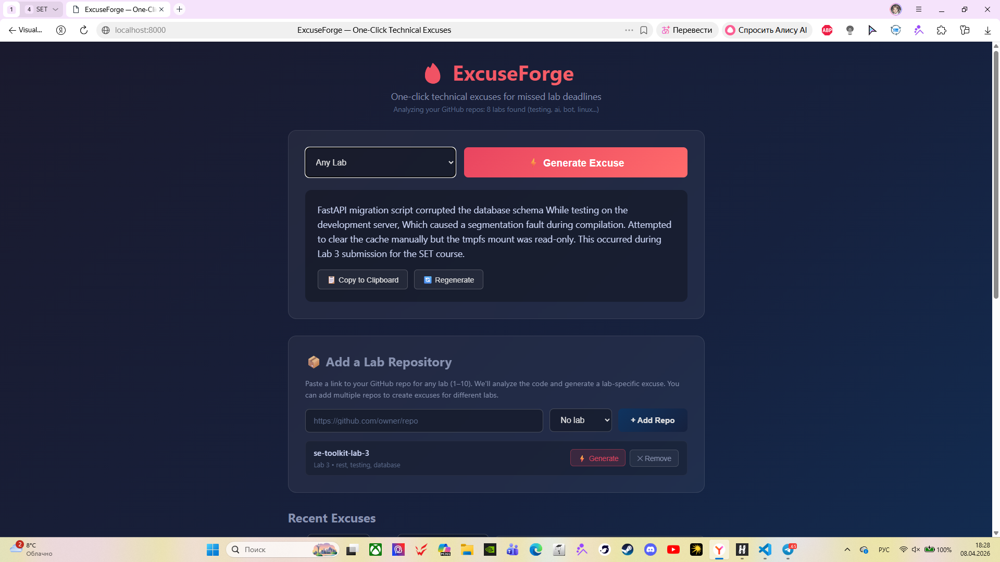
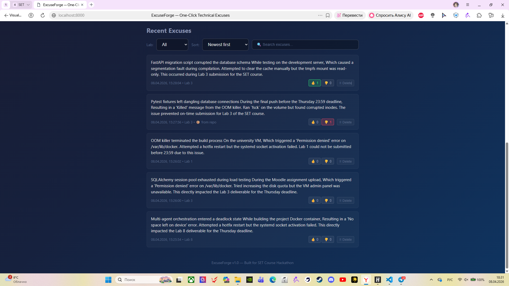
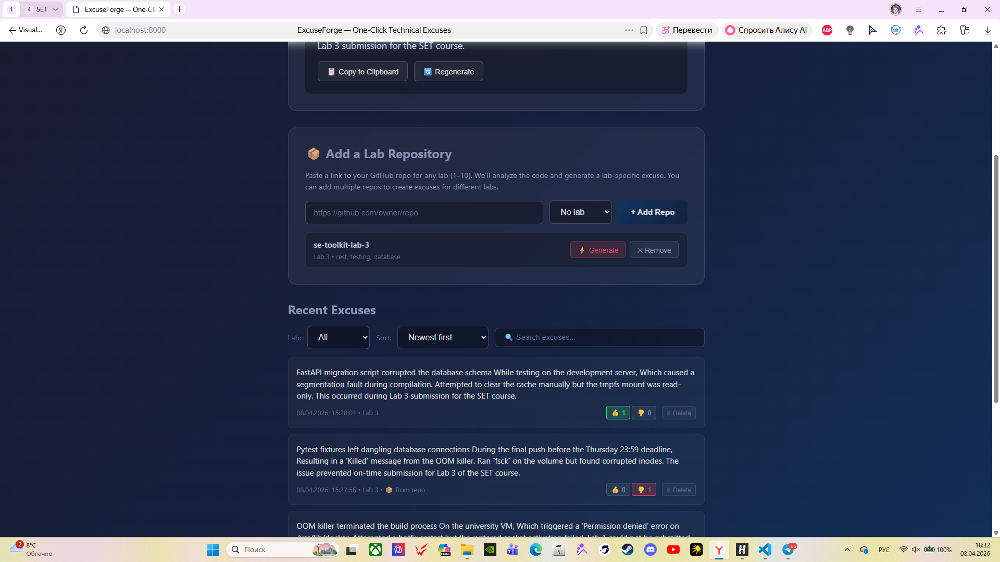

# ExcuseForge

One-click realistic, technically-sounding excuse generator for university students who missed lab deadlines.

## Demo

### Screenshots

#### Main page — excuse generation


#### History — search, sort, filter, vote


#### Linked repositories — add repos for lab-specific excuses


> *Screenshots are placeholder images. Replace with actual screenshots of your deployment.*

### Product context

| | |
|---|---|
| **End users** | IT university students in the SET course who missed the Thursday 23:59 lab submission deadline |
| **Problem** | Students waste 30+ minutes inventing fake technical excuses that sound implausible and aren't convincing to TAs |
| **Product idea** | ExcuseForge generates course-specific, technically plausible excuses in 1 second with a single click — no prompt writing needed |

## Implementation

### Architecture

```
Browser (HTML/JS/CSS)  →  FastAPI Backend (Python)  →  SQLite Database
                              ↓
                    GitHub API (repo analysis)
```

### Version 1 (shown to TA during the lab)

- One-click excuse generation with lab-specific context (Labs 1–10)
- Copy to clipboard
- Excuse history with timestamps
- SQLite database for persistence
- Basic web UI with responsive design

### Version 2 (deployed)

Everything from Version 1, plus:

- 📦 **GitHub repository linking** — paste any lab repo URL, auto-analyse technologies, generate excuses tied to that repo
- 👍👎 **One-time voting** — each user (by IP) can vote once per excuse, re-voting switches or removes the vote
- 🔍 **Full-text search** — filter excuses by keyword with debounce
- 🔄 **Multi-column sorting** — by date, upvotes, downvotes (ascending/descending)
- 🏷️ **Per-lab filtering** — show only excuses for a specific lab
- 🗑️ **Delete excuses** — remove old excuses from history
- REST API with 9 documented endpoints
- MIT license

## Features

### Implemented

| Feature | Description |
|---------|-------------|
| One-click generation | Select a lab, click Generate, get a plausible excuse |
| Lab-specific causes | Each lab (1–10) has unique technical scenarios |
| Copy to clipboard | One-click copy with visual confirmation |
| GitHub repo linking | Add any lab repo by URL, analyse its tech stack |
| Search | Real-time keyword search with 350ms debounce |
| Sort | 6 modes: newest, oldest, most/least upvoted, most/least downvoted |
| Lab filter | Filter history by lab number |
| Voting | One-time upvote/downvote with toggle (click again to remove) |
| Delete | Remove any excuse from history |
| History | Timestamped, filterable, searchable |
| REST API | 9 endpoints, fully documented |

### Not yet implemented

- [ ] Docker Compose deployment
- [ ] PostgreSQL migration
- [ ] OAuth-based user identification for voting
- [ ] Excuse sharing/export (PDF, image)

## Usage

1. Open the app in your browser (`http://localhost:8000` or your VM IP)
2. Select the lab number from the dropdown (optional)
3. Click **⚡ Generate Excuse**
4. Read the generated excuse
5. Click **📋 Copy to Clipboard** to copy it
6. Paste into Moodle/chat for your TA

### Linked repositories

To generate lab-specific excuses from your own repos:

1. Scroll to the **📦 Add a Lab Repository** section
2. Paste a GitHub URL (e.g. `https://github.com/mimics0s/se-toolkit-lab-3`)
3. Select the corresponding lab number
4. Click **+ Add Repo**
5. Use the **⚡ Generate** button on any saved repo to create an excuse using its tech context

### Filtering and searching history

- **Lab filter** — show only excuses for a specific lab
- **Sort dropdown** — choose ordering (date, votes)
- **Search bar** — type any keyword to filter excuses in real time

## Deployment

### OS

Ubuntu 24.04 LTS (same as the university VMs).

### Prerequisites

The following must be installed on the VM:

- Python 3.14+ (or 3.12+)
- pip (Python package manager)
- A web browser or any HTTP client
- Port 8000 available

### Step-by-step

#### 1. Clone the repository

```bash
git clone https://github.com/<your-username>/se-toolkit-hackathon.git
cd se-toolkit-hackathon
```

#### 2. Install dependencies

```bash
pip install -r requirements.txt
```

#### 3. Start the server

```bash
uvicorn app.main:app --host 0.0.0.0 --port 8000
```

#### 4. Open in browser

Navigate to:

- **Local:** `http://localhost:8000`
- **VM:** `http://<vm-ip>:8000`

The database (`excuses.db`) is created automatically on first run.

### Project structure

```
se-toolkit-hackathon/
├── app/
│   ├── __init__.py
│   ├── main.py               # FastAPI app, routes, schemas
│   ├── models.py             # SQLAlchemy models (Excuse, SavedRepo, Vote)
│   ├── database.py           # DB engine, session
│   ├── excuse_generator.py   # Template-based excuse generation
│   └── github_analyzer.py    # GitHub API fetcher, tech analysis
├── static/
│   └── index.html            # Single-page web app (HTML + CSS + JS)
├── requirements.txt
├── pyproject.toml
├── LICENSE                   # MIT License
└── README.md
```
